# Database

The HAWC database is a [PostgreSQL](https://www.postgresql.org/) database. See diagrams for individual apps withing the larger HAWC project.

## Literature screening schema

<figure markdown>
  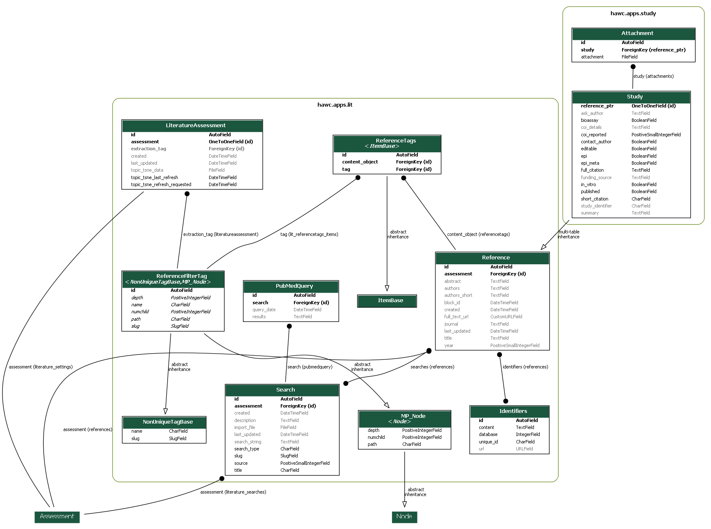
  <figcaption>Study and literature schema. The image is very large; please save/or open in another tab.</figcaption>
</figure>

## Study and risk of bias schema

<figure markdown>
  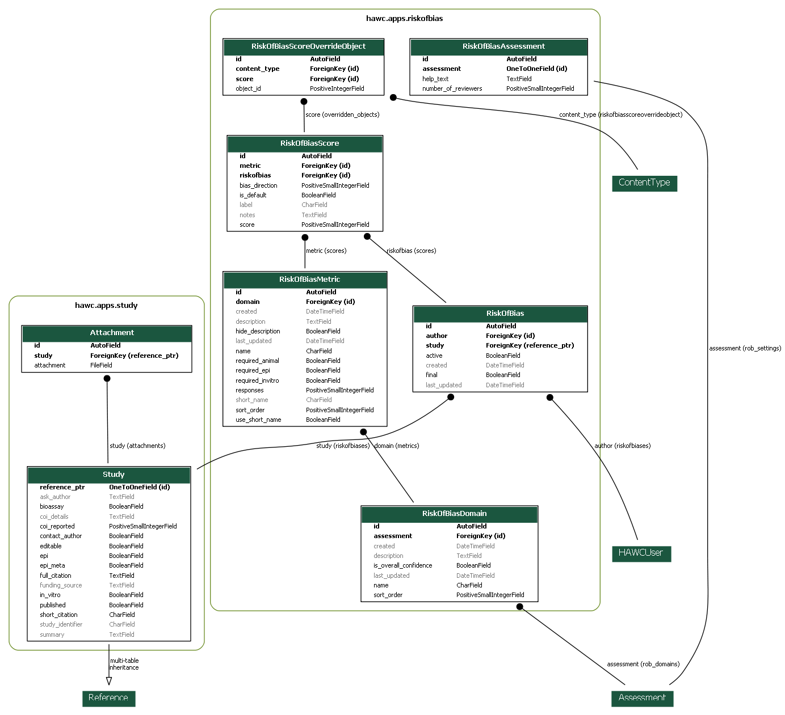
  <figcaption>Study and risk-of bias schema. The image is very large; please save/or open in another tab.</figcaption>
</figure>

## Animal bioassay schema

<figure markdown>
  
  <figcaption>Animal bioassay v2 schema. The image is very large; please save/or open in another tab.</figcaption>
</figure>

<figure markdown>
  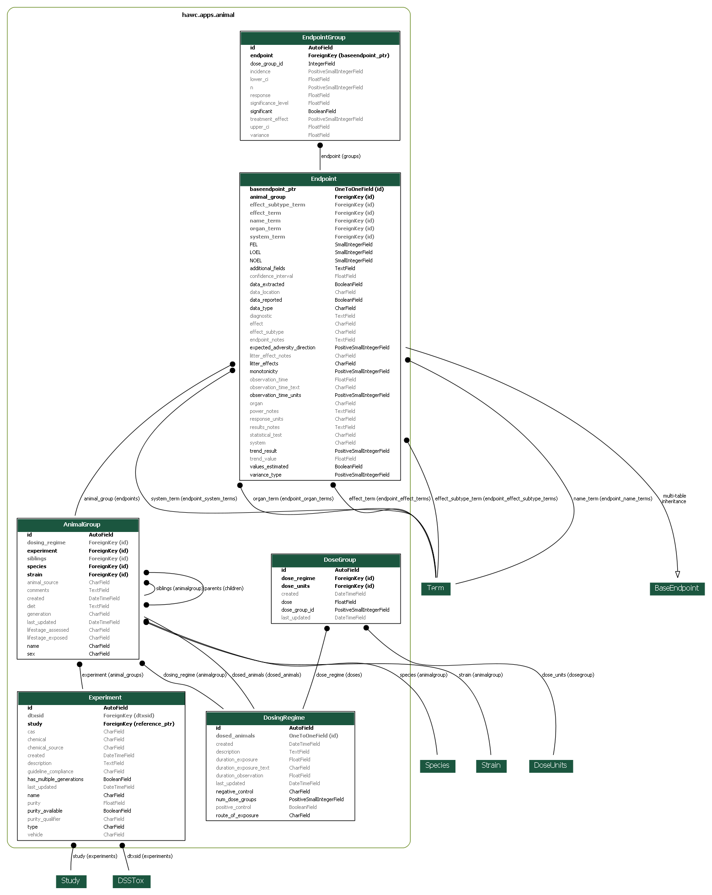
  <figcaption>Animal bioassay schema. The image is very large; please save/or open in another tab.</figcaption>
</figure>

<figure markdown>
  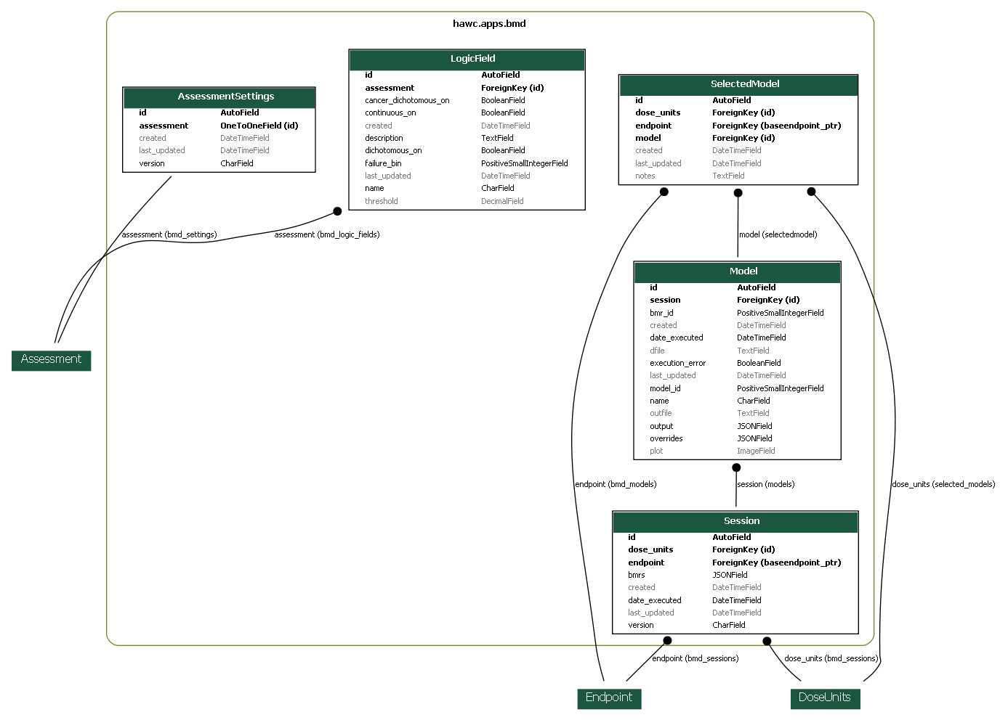
  <figcaption>BMD schema. The image is very large; please save/or open in another tab.</figcaption>
</figure>

## Epidemiology schema

<figure markdown>
  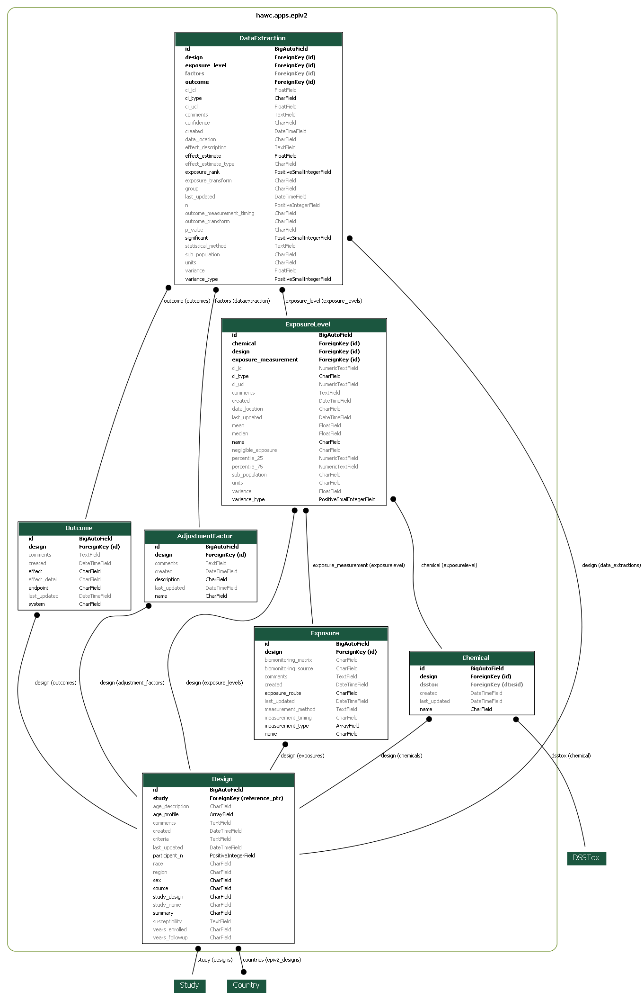
  <figcaption>Epidemiology v2 schema. The image is very large; please save/or open in another tab.</figcaption>
</figure>

<figure markdown>
  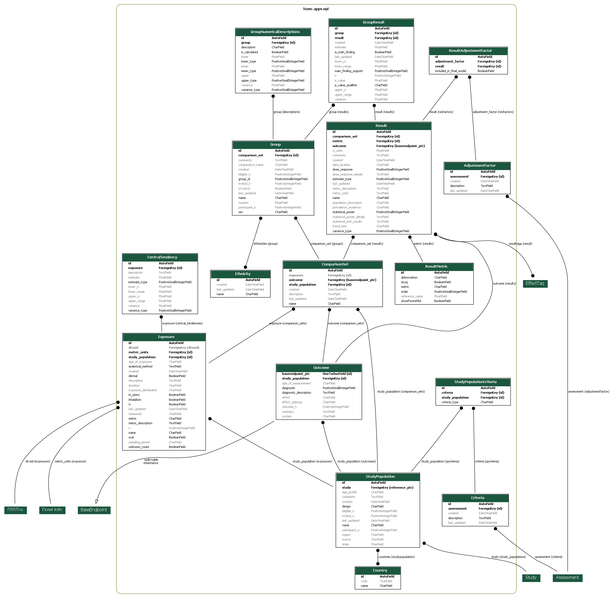
  <figcaption>Epidemiology schema. The image is very large; please save/or open in another tab.</figcaption>
</figure>

<figure markdown>
  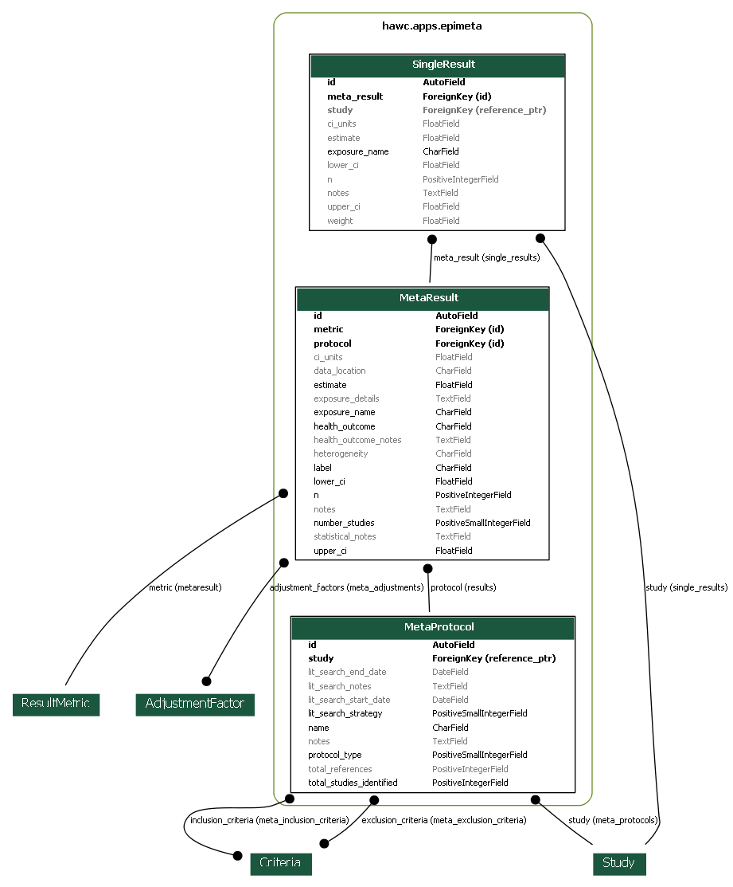
  <figcaption>Epidemiology meta-analysis schema. The image is very large; please save/or open in another tab.</figcaption>
</figure>


## Ecology schema

<figure markdown>
  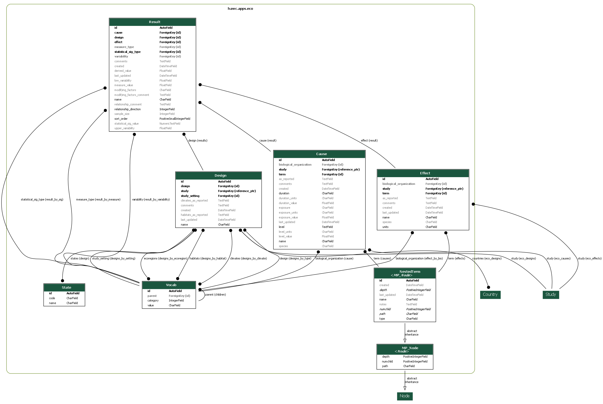
  <figcaption>Ecology schema. The image is very large; please save/or open in another tab.</figcaption>
</figure>

## *In-vitro* data schema

<figure markdown>
  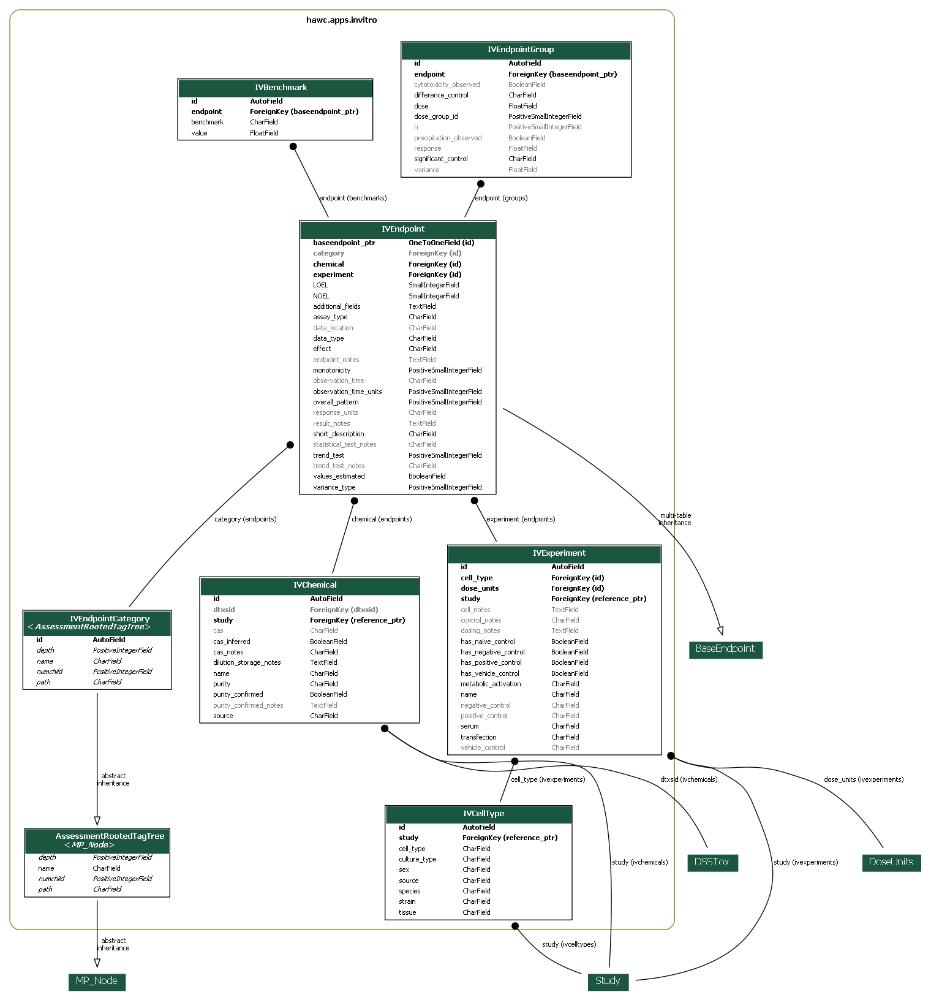
  <figcaption>*In vitro* data schema. The image is very large; please save/or open in another tab.</figcaption>
</figure>

## *Vocabulary* schema

<figure markdown>
  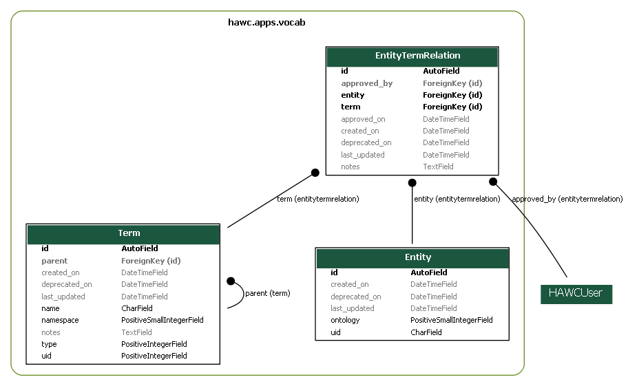
  <figcaption>Controlled vocabulary + ontology mapping data schema. The image is very large; please save/or open in another tab.</figcaption>
</figure>

## *Summary* schema

<figure markdown>
  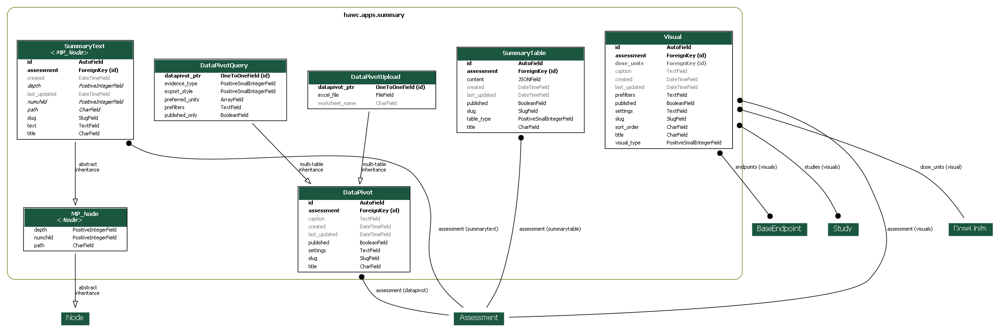
  <figcaption>Summary data schema. The image is very large; please save/or open in another tab.</figcaption>
</figure>

## Schema figure generation

To generate these database schema diagrams:

```bash
conda install graphviz
pip install -U pydot
manage graph_models -g --pydot -o ./docs/docs/static/img/hawc-schema-lit.png lit study
manage graph_models -g --pydot -o ./docs/docs/static/img/hawc-schema-study.png study riskofbias
manage graph_models -g --pydot -o ./docs/docs/static/img/hawc-schema-animal.png animal
manage graph_models -g --pydot -o ./docs/docs/static/img/hawc-schema-animalv2.png animalv2
manage graph_models -g --pydot -o ./docs/docs/static/img/hawc-schema-bmd.png bmd
manage graph_models -g --pydot -o ./docs/docs/static/img/hawc-schema-epi.png epi
manage graph_models -g --pydot -o ./docs/docs/static/img/hawc-schema-epiv2.png epiv2
manage graph_models -g --pydot -o ./docs/docs/static/img/hawc-schema-epimeta.png epimeta
manage graph_models -g --pydot -o ./docs/docs/static/img/hawc-schema-eco.png eco
manage graph_models -g --pydot -o ./docs/docs/static/img/hawc-schema-invitro.png invitro
manage graph_models -g --pydot -o ./docs/docs/static/img/hawc-schema-vocab.png vocab
manage graph_models -g --pydot -o ./docs/docs/static/img/hawc-schema-summary.png summary
```
