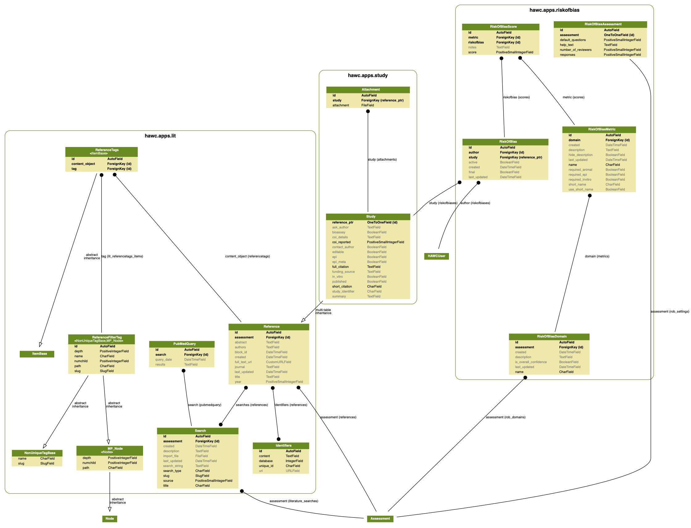
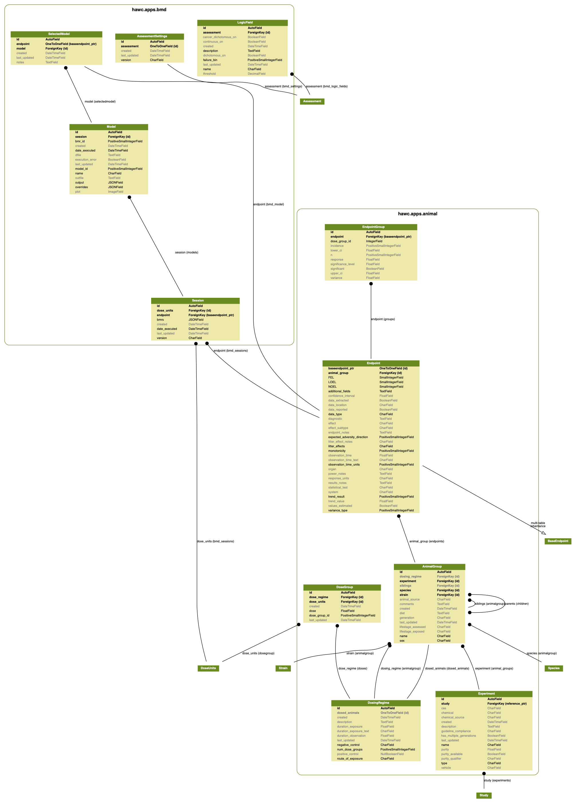
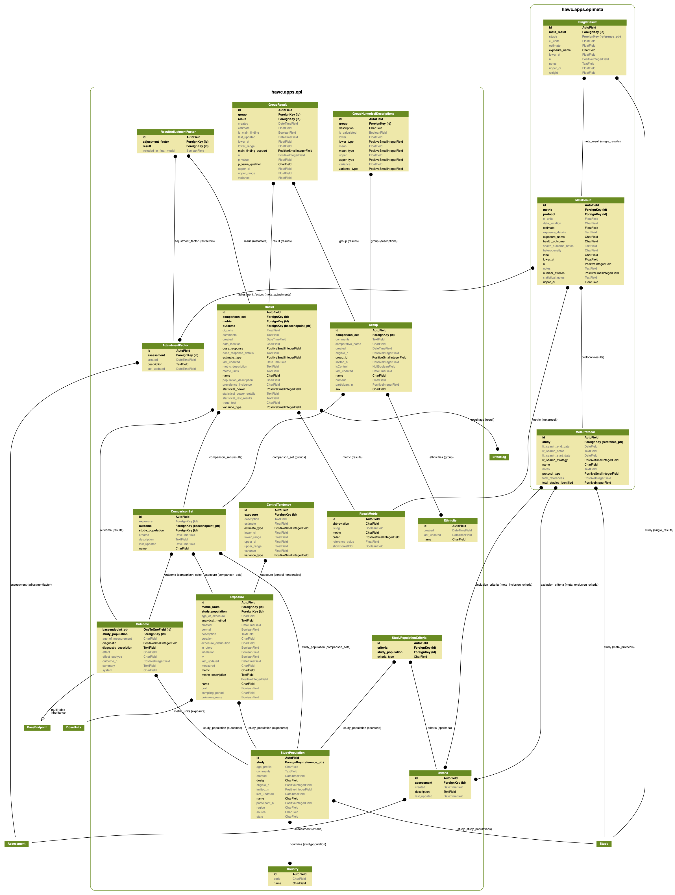
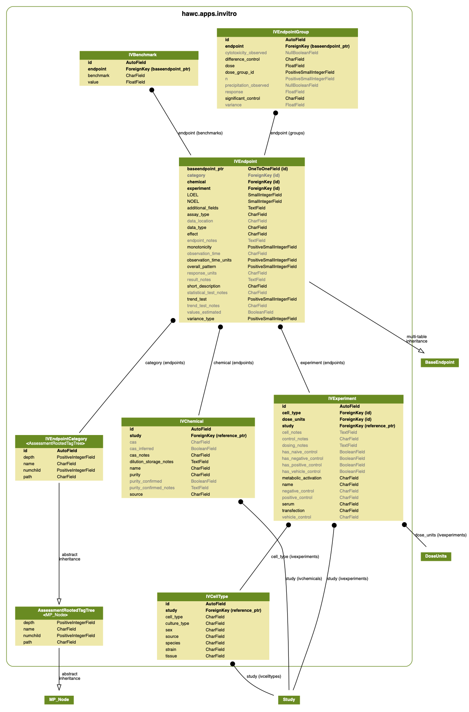
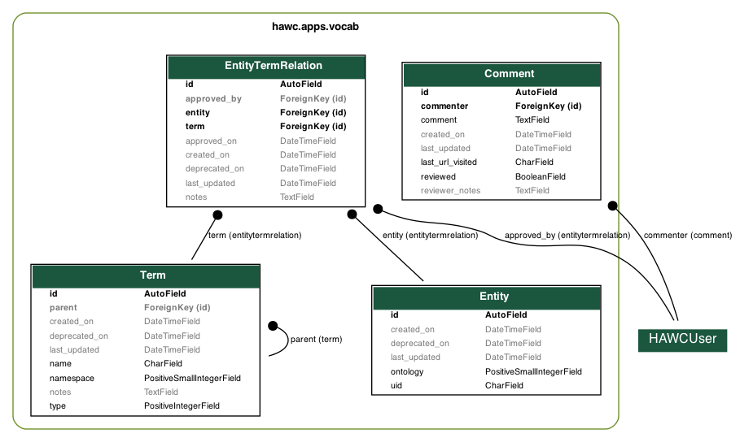

# Database

The HAWC database is a [PostgreSQL](https://www.postgresql.org/) database; it utilizes some advanced PostgreSQL-specific feature such as [JSON fields](https://www.postgresql.org/docs/current/static/datatype-json.html). The overall database schema is as follows (sections below break down the schema into more digestible components):

<figure markdown>
  
  <figcaption>The image is very large; please save/or open in another tab.</figcaption>
</figure>

## Study and risk of bias schema

<figure markdown>
  
  <figcaption>Study, literature, and risk-of bias schema. The image is very large; please save/or open in another tab.</figcaption>
</figure>

## Animal bioassay schema

<figure markdown>
  
  <figcaption>Animal bioassay and BMD schema. The image is very large; please save/or open in another tab.</figcaption>
</figure>

## Epidemiology schema

<figure markdown>
  
  <figcaption>Epidemiology and epidemiological meta-analysis schema. The image is very large; please save/or open in another tab.</figcaption>
</figure>

## *In-vitro* data schema

<figure markdown>
  
  <figcaption>*In vitro* data schema. The image is very large; please save/or open in another tab.</figcaption>
</figure>

## *Vocabulary* schema

<figure markdown>
  
  <figcaption>Controlled vocabulary + ontology mapping data schema. The image is very large; please save/or open in another tab.</figcaption>
</figure>

## Schema figure generation

To generate these database schema diagrams:

```bash
manage graph_models \
    -a -g --pydot \
    -o ./docs/source/_static/hawc-schema.png

manage graph_models \
    lit study riskofbias \
    -g --pydot \
    -o ./docs/source/_static/hawc-study-schema.png

manage graph_models \
    animal bmd \
    -g --pydot \
    -o ./docs/source/_static/hawc-animal-schema.png

manage graph_models \
    epi epimeta \
    -g --pydot \
    -o ./docs/source/_static/hawc-epi-schema.png

manage graph_models \
    invitro \
    -g --pydot \
    -o ./docs/source/_static/hawc-invitro-schema.png

manage graph_models \
    vocab \
    -g --pydot \
    -o ./docs/source/_static/hawc-vocab-schema.png
```
