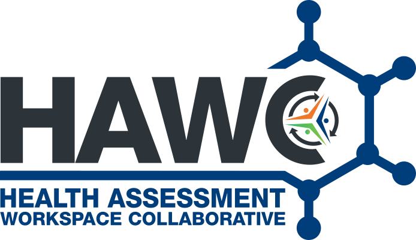

# Home

The Health Assessment Workspace Collaborative (HAWC) is a website designed to capture key data and analyses performed in conducting human-health assessment of chemicals and other environmental exposures in-order to establish hazard identification and potentially derive quantitative levels of concern.

The public website is currently available on <https://hawcproject.org>, though there are additional versions available in other locations, including private deployments.

