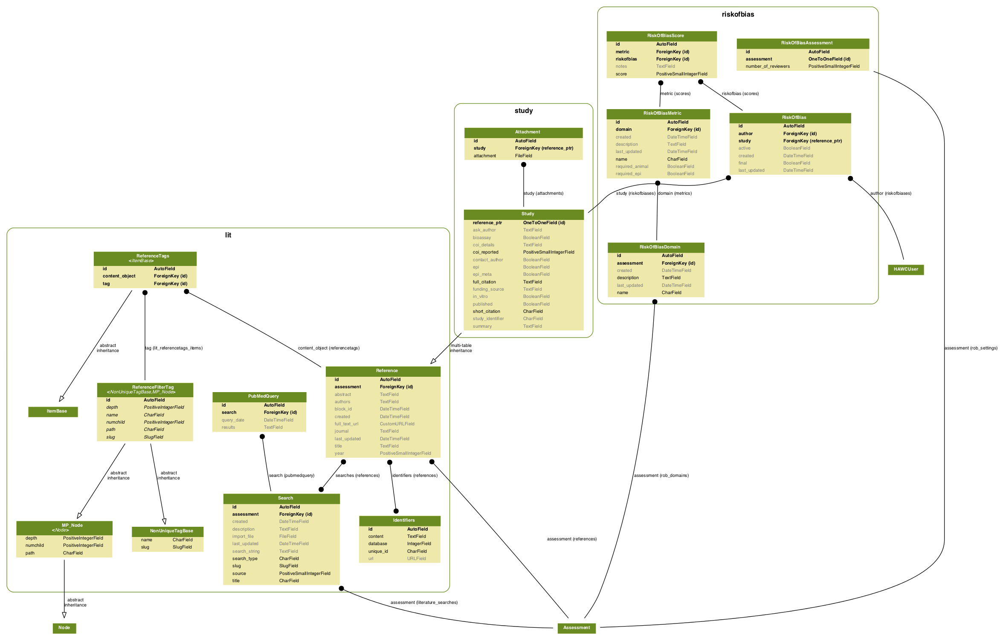
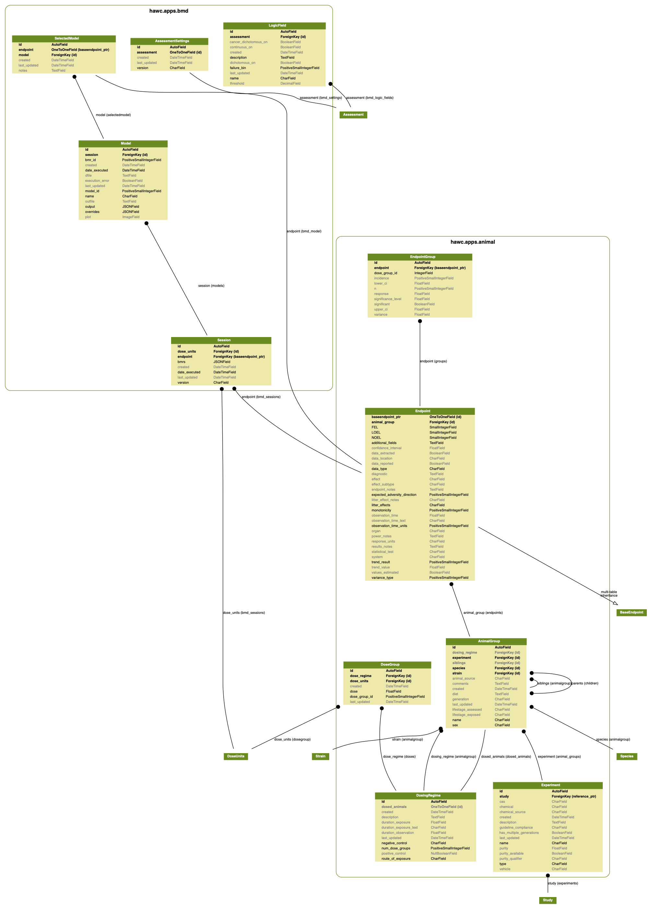
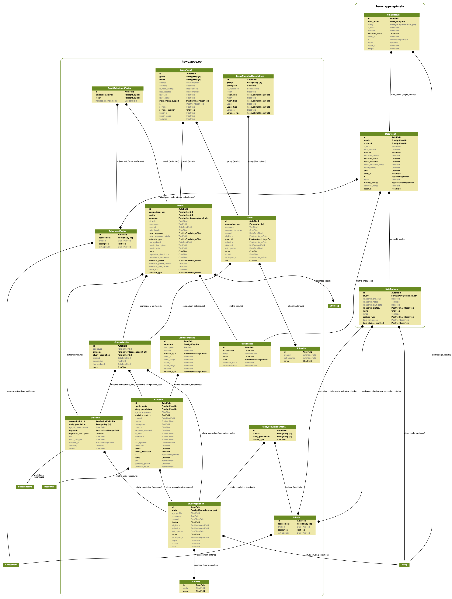
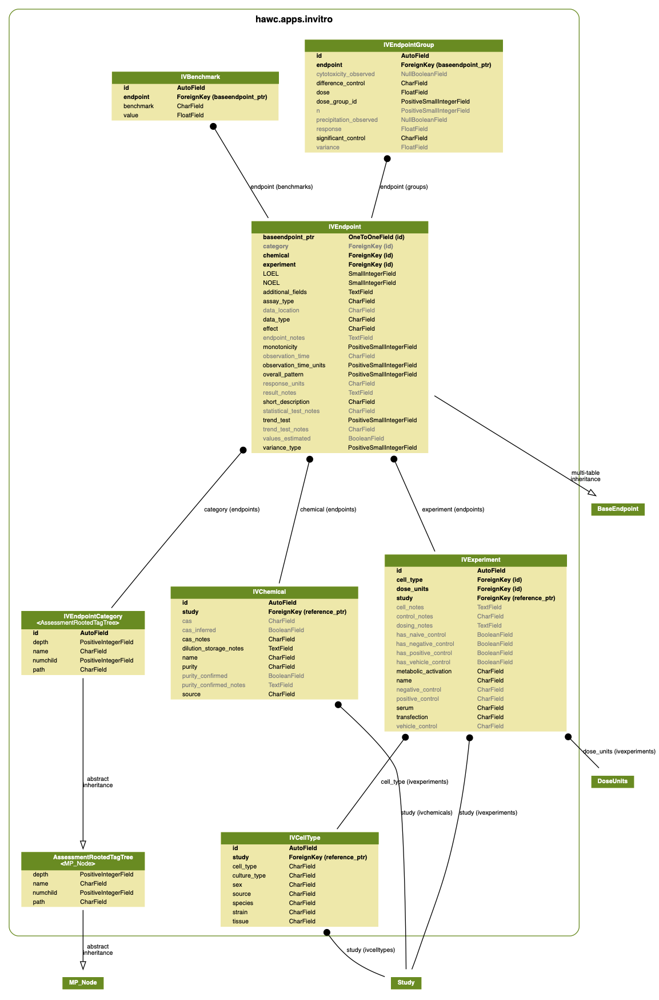
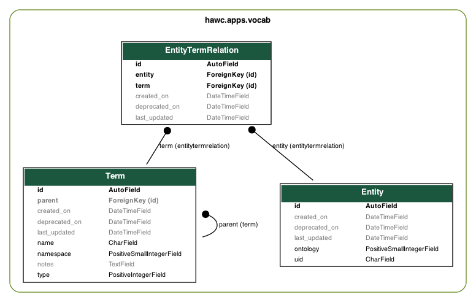

Database
========

The HAWC database is a `PostgreSQL`_ database; it utilizes some PostgreSQL-specific feature such as `JSON fields`_`. Therefore, it may be possible to migrate the data to other database formats, but it wouldn't be a trivial exercise. The overall database schema is as follows (sections below break down the schema into more digestible components):

.. _`PostgreSQL`: https://www.postgresql.org/
.. _`JSON fields`: https://www.postgresql.org/docs/current/static/datatype-json.html

.. figure:: _static/hawc-schema.png
   :width: 1000
   :align: center
   :alt: HAWC data schema

   The image is very large; please save/or open in another tab.

Study and risk of bias schema
-----------------------------

   Study, literature, and risk-of bias schema. The image is very large; please save/or open in another tab.

Animal bioassay schema
----------------------

   Animal bioassay and BMD schema. The image is very large; please save/or open in another tab.

Epidemiology schema
-------------------

   Epidemiology and epidemiological meta-analysis schema. The image is very large; please save/or open in another tab.

*In-vitro* data schema
----------------------

   *In vitro* data schema. The image is very large; please save/or open in another tab.

*Vocabulary* schema
----------------------

   Controlled vocabulary + ontology mapping data schema. The image is very large; please save/or open in another tab.

Schema figure generation
------------------------

To generate these database schema diagrams:

.. code-block:: bash

    manage.py graph_models \
        -a -g --pydot \
        -o ./docs/source/_static/hawc-schema.png

    manage.py graph_models \
        lit study riskofbias \
        -g --pydot \
        -o ./docs/source/_static/hawc-study-schema.png

    manage.py graph_models \
        animal bmd \
        -g --pydot \
        -o ./docs/source/_static/hawc-animal-schema.png

    manage.py graph_models \
        epi epimeta \
        -g --pydot \
        -o ./docs/source/_static/hawc-epi-schema.png

    manage.py graph_models \
        invitro \
        -g --pydot \
        -o ./docs/source/_static/hawc-invitro-schema.png

    manage.py graph_models \
        vocab \
        -g --pydot \
        -o ./docs/source/_static/hawc-vocab-schema.png
