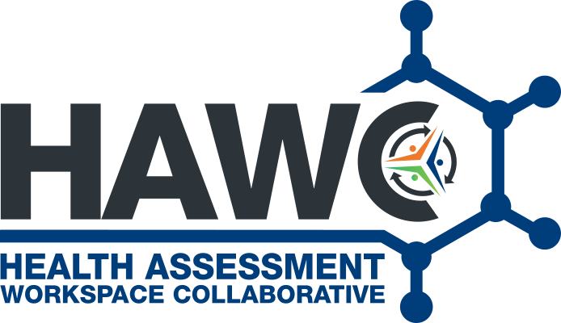

HAWC documentation
==================

The Health Assessment Workspace Collaborative (HAWC) is a website designed to capture key data and analyses performed in conducting human-health assessment of chemicals and other environmental exposures in-order to establish hazard identification and potentially derive quantitative levels of concern.

The public website is currently available on `<https://hawcproject.org>`_, though there are additional versions available in other locations, including private deployments.

.. image:: https://img.shields.io/website?url=https%3A%2F%2Fhawcproject.org
   :target: https://hawcproject.org

.. image:: https://zenodo.org/badge/25273569.svg
   :target: https://zenodo.org/badge/latestdoi/25273569

.. image:: https://img.shields.io/github/last-commit/shapiromatron/hawc.svg
   :target: https://github.com/shapiromatron/hawc

.. toctree::
   :maxdepth: 2

   development
   client
   database
   deployment
   stats
   pm

Appendix:

.. toctree::
   appdx_a_ci_description
